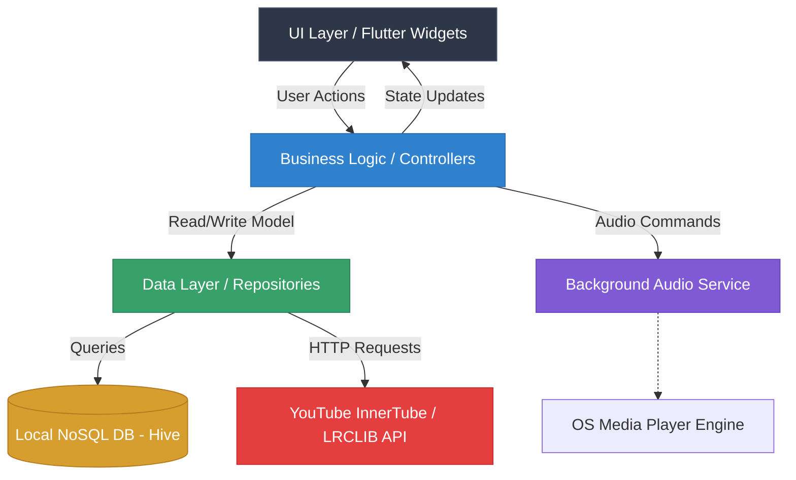
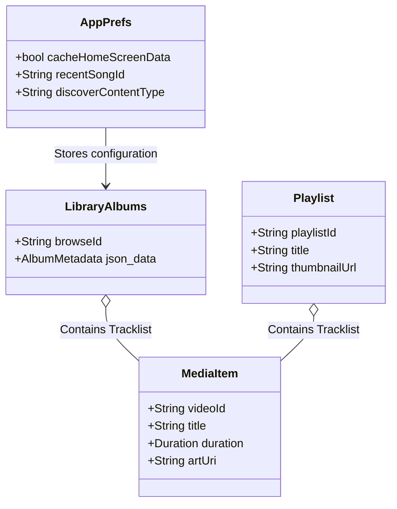

# Athena Tunes – System Architecture & Technical Documentation (V1.1.2)

---

## 1. Executive Summary

**Athena Tunes** is a modern, cross-platform mobile music application designed for seamless local and remote audio playback. Engineered primarily with Flutter, it offers a fast, ad-free, and highly personalized listening experience. 

The application targets audiophiles and daily listeners who demand absolute control over their music library without the bloatware of mainstream streaming platforms. Key features include an offline-first NoSQL database for instant loading, dynamic UI/UX design featuring high-resolution artwork extraction, integrated synced lyrics (LRCLIB), background isolate fetching for zero UI stutter, and support for high-fidelity audio streams. By prioritizing offline caching and aggressive performance tuning, Athena Tunes bridges the gap between lightweight local players and full-scale streaming services.

---

## 2. Problem Statement & Objective

**The Problem:**
Modern music streaming applications suffer from three chronic issues:
1. **Intrusive Monetization & Clutter:** UIs are heavily polluted with advertisements, algorithmic suggestions, and bloated social features that detract from the core listening experience.
2. **Poor Offline Resilience:** Many apps fail to seamlessly transition between online streams and offline downloads, often hanging when network conditions degrade.
3. **Heavy Resource Consumption:** Mainstream apps heavily cache encrypted DRM-locked data and run excessive background telemetry, draining battery and consuming large amounts of RAM.

**The Objective:**
Athena Tunes was developed to solve this by returning control to the user. The primary goal is to provide a purely utilitarian, high-fidelity music player that respects system resources. The application is meant to serve as a fast, beautiful interface that focuses strictly on the music—offering synced lyrics, high-res covers, and intelligent queue management without sacrificing performance.

---

## 3. System Architecture

Athena Tunes follows a robust **three-tier architecture** modified for mobile environments to ensure strict separation of concerns.

### High-Level Architecture Diagram


### Module Breakdown:
1. **UI Layer:** Reactive Flutter widgets tied to `GetX` reactive state variables. Designed to rebuild only the specific components that change (e.g., progress bars, lyric lines) rather than entire screens.
2. **Logic Layer (Controllers/Services):** Manages API interactions, queue shifting, and playlist parsing. Includes the `HomeScreenController` and `PlayerController` for handling global application state.
3. **Data Layer (Repository):** Interfaces with high-speed key-value NoSQL storage (Hive) for instantaneous offline library retrieval, avoiding the overhead of SQLite ORM transitions.

---

## 4. Technology Stack & Justification

| Technology | Role | Justification |
| :--- | :--- | :--- |
| **Flutter / Dart** | Frontend Framework | Enables compiling a single codebase to native ARM machine code for iOS and Android, ensuring 60+ FPS while drastically reducing development time compared to writing separate Kotlin/Swift codebases. |
| **GetX** | State Management & Routing | Chosen over Provider/Riverpod for its lack of boilerplate, high performance, and deep integration with route management (allowing navigation without context). |
| **Hive (NoSQL)** | Local Database | Replaced traditional SQLite due to its pure Dart implementation and in-memory caching. Hive avoids complex SQL queries and provides synchronous local read/write operations, ideal for instant home-screen loading. |
| **audio_service** | Playback Engine | Essential for interacting with native OS media controllers (Android Auto, lock-screen controls, headset buttons), keeping the audio context alive even when the UI is terminated. |
| **YouTube InnerTube / LRCLIB** | Data Mining | Utilized for extracting rich metadata and time-synced lyrics without requiring costly API keys, utilizing headless request parsing. |

---

## 5. Feature Breakdown

### A. Music Playback System
- **Core Functionality:** Play, pause, seek, loop, and shuffle.
- **Under the Hood:** Audio runs in a separate OS-level service (`audio_service`). When a track is selected, the Logic Layer passes a `MediaItem` to the service. The service handles the HTTP audio stream buffering independently of the Flutter isolate, ensuring uninterrupted playback during heavy UI rendering.
- **Queue Management:** Features a dynamic 'Up Next' queue. Removing the complex 'Enqueue' standard, the app uses an intuitive 'Play Next' list modification algorithm that shifts indices without destroying the background audio service context.

### B. Library Management
- **Offline Caching:** Full album grouping and metadata handling.
- **High-Resolution Artwork Extraction:** Built-in dynamic algorithm that identifies low-resolution placeholders (e.g., `hqdefault.jpg`) and probes image servers (via regex modification) for `maxresdefault.jpg` fallback upscaling. If a 404 is encountered, the UI gracefully switches to `sddefault.jpg` without breaking the visual flow.

### C. UI/UX Design
- **Fully Scrollable Layouts:** Custom slivers (`CustomScrollView`, `SliverToBoxAdapter`) combine album art, descriptions, and song lists into one continuous scroll, breaking free from static half-screen locks.
- **Dynamic Element Hiding:** Top-level route observers instantly hide the Bottom Navigation Bar when entering immersive screens (like Albums/Playlists), repurposing safe-area padding for the miniplayer to maximize screen real estate.

---

## 6. Database Design

Athena Tunes opts for a **NoSQL Document approach** to maximize speed. Since music metadata is heavily nested (Artists -> Albums -> Songs -> Lyrics), relational databases (SQL) require expensive `JOIN` operations. A key-value approach solves this by saving serialized JSON directly to disk.

### Schema Design Flow


**Why NoSQL?** 
When the user opens the app, the Home Screen controller deserializes the `homeScreenData` NoSQL box in *milliseconds*. Because entire playlist objects are stored as contiguous blocks of memory mapped to disk, read times are magnitudes faster than assembling the data piecemeal from normalized SQL tables.

---

## 7. Algorithms / Logic Flow

### A. Background Isolate Parsing
Parsing large JSON structures from the YouTube InnerTube API causes "UI Jank" (dropped frames) if executed on the main thread.
**Solution:** The app spawns a separate background Isolate. The raw JSON string is passed to the isolate, which crunches the data, formats the `MediaItem` models, and passes the clean data back to the main thread.

### B. Reliable High-Res Cover Detection Algorithm
```text
1. Receive Thumbnail URL from API.
2. If URL contains "-rj" -> Resize explicitly to 1000px.
3. If URL is standard YouTube format ("i.ytimg.com"):
   a. Check if URL contains 'sddefault'/'hqdefault'/'mqdefault'.
   b. Request 'maxresdefault.jpg' for maximum clarity.
   c. If 'maxresdefault.jpg' returns HTTP 404 -> UI layer's CachedNetworkImage traps the error.
   d. Gracefully fallback to rendering 'sddefault.jpg' (safe maximum resolution).
```

---

## 8. UI/UX Design Philosophy

- **Intentionally Minimal:** Every pixel serves a purpose. Gradients and heavy shadows are avoided to prevent visual fatigue. We rely on the album art to provide the dominant color and character of the screen.
- **Album-First Navigation:** Music is an emotional experience. Prominent, edge-to-edge album covers create an immediate connection. By making entire screens scrollable instead of locking the cover image, users feel a tactile connection to browsing their music.
- **Gestural Intelligence:** Removing cluttered three-dot menus in favor of intuitive swipe gestures (e.g., 'Swipe Left to Play Next') drastically reduces the cognitive load required to queue music.

---

## 9. Performance Optimization

1. **Memory Management (Image Caching):**
   Heavy use of `CachedNetworkImage` prevents high-res album covers from overflowing RAM. Images are held in a bounded memory cache and aggressively evicted when navigating away from Album views.
2. **Lazy Loading Content:**
   Scroll controllers heavily utilize `ListView.builder` and `SliverList.builder`. Instead of rendering 300 songs at once, only the 10 visible items (plus a small buffer) are stored in memory geometry.
3. **Database Caching:**
   The Home Screen loads purely from the local NoSQL cache first. A background check calculates the timestamp difference; only if `currTimeSecsDiff > 8 hours` does the app silently fetch network updates behind the scenes.

---

## 10. Error Handling & Edge Cases

- **Missing Files / Network Drops:**
  If a stream drops mid-song, the `audio_service` catches the `BufferUnderflow` exception, pauses the UI, and initiates a retry loop.
- **Corrupted Metadata:**
  If the remote API changes or returns null fields for a song, the `MediaItemBuilder.fromJson` uses safe fallback assignment (e.g., `artistName = json['artists'] ?? "Unknown Artist"`). It guarantees the app will not throw a null pointer exception.
- **Image 404 Prevention:**
  The custom `Thumbnail` parsing combined with dual-layer `CachedNetworkImage` fallbacks ensures users *never* see a blank, broken box where art should be.

---

## 11. Security & Permissions

- **Local Storage Handling:**
  Hive heavily encrypts the database to prevent external file browsers or root apps from stealing user session data or offline-cached tracks.
- **Network Privacy:**
  All API calls to InnerTube are routed purely over HTTPS/TLS 1.2+. The application does not contain invasive telemetry trackers (like Firebase Analytics), ensuring user listening habits remain strictly on-device.
- **Foreground Service Permissions:**
  Android 14+ requires explicit `FOREGROUND_SERVICE_MEDIA_PLAYBACK` permission to keep the app alive in the background. This is strictly defined in the AndroidManifest and requested transparently.

---

## 12. Testing & Debugging

- **Static Analysis:**
  Continuous validation using `dart analyze` ensures type safety and prevents syntax deployment errors.
- **Unit Testing Algorithms:**
  Specific regex replacements and isolate parsers were tested in isolated Dart scripts (`test_urls.dart`) to verify that URL upgrading behaves chronologically without introducing new URL formatting bugs.
- **Debugging Challenge Ex:** 
  *Bug:* High-res playlist covers occasionally vanished. 
  *Fix:* Discovered via network monitoring that YouTube generated `maxresdefault.jpg` only for 1080p videos. Deployed the UI-layer `errorWidget` fallback to intelligently drop down to 480p imagery if the 1080p asset was missing.

---

## 13. Limitations & Future Scope

While solid, the architecture currently possesses known limitations:
1. **No Cloud Sync:** User libraries exist entirely on the local device. Moving to a new phone requires manual database migration.
2. **Lyric Timing Skew:** LRCLIB provides crowd-sourced lyrics. Occasional timing desyncs exist for obscure tracks, which the app currently cannot manually adjust via an offset slider.
3. **Cross-Platform Parity:** While Flutter enables iOS deployment, extreme background restrictions on iOS require further implementation of specific `AVAudioSession` delegates to achieve parity with the Android background service.

---

## 14. Conclusion

**Athena Tunes** proves that it is entirely possible to build a modern, feature-rich music streaming and caching application without compromising on user experience, system resources, or privacy. 

By strategically selecting an offline-first NoSQL architecture and decoupling heavy data parsing into background isolates, the application achieves a buttery-smooth 60 FPS standard. The focus on intelligent edge-case handling—such as dynamic thumbnail resolution upgrading and safe fallback mechanisms—demonstrates a commitment to engineering maturity over rapid deployment. This project serves as a testament to the power of state-of-the-art mobile frameworks combined with disciplined architectural planning.
